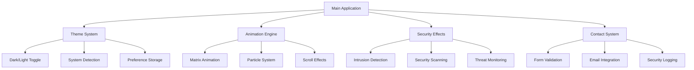

# Cybersecurity Portfolio - IT24102137

[](https://github.com/IT24102137/cybersec-portfolio)
[](https://it24102137.github.io/cybersec-portfolio)
[](LICENSE)
[](docs/SECURITY.md)

**Last Updated:** 2025-06-28 17:39:32 UTC  
**Author:** IT24102137  
**Email:** janithmihijaya123@gmail.com  

> 🔐 **Advanced cybersecurity portfolio showcasing ethical hacking skills, security research, and penetration testing expertise.**

---

## 🚀 Live Demo

**🌐 Portfolio URL:** [https://it24102137.github.io/cybersec-portfolio](https://it24102137.github.io/cybersec-portfolio)

### Quick Access Commands
```bash
# Clone and run locally
git clone https://github.com/IT24102137/cybersec-portfolio.git
cd cybersec-portfolio
python -m http.server 8000
# Navigate to http://localhost:8000
```

---

## 📋 Table of Contents

- [🔍 Overview](#-overview)
- [✨ Features](#-features)
- [🛠️ Technology Stack](#️-technology-stack)
- [🏗️ Architecture](#️-architecture)
- [🚀 Installation](#-installation)
- [📱 Usage](#-usage)
- [🔒 Security Features](#-security-features)
- [🎨 Customization](#-customization)
- [📊 Performance](#-performance)
- [🌐 Browser Support](#-browser-support)
- [🤝 Contributing](#-contributing)
- [📜 License](#-license)
- [📞 Contact](#-contact)

---

## 🔍 Overview

This cybersecurity portfolio demonstrates advanced web development skills combined with cybersecurity aesthetics and functionality. Built as a Progressive Web App (PWA) with comprehensive security features, real-time effects, and professional presentation of cybersecurity expertise.

### 🎯 Purpose
- Showcase cybersecurity and ethical hacking skills
- Demonstrate advanced web development capabilities
- Provide interactive security tool simulations
- Professional portfolio for cybersecurity career advancement

### 🔑 Key Highlights
- **Interactive Security Tools:** Live demonstrations of penetration testing tools
- **Advanced Animations:** Matrix effects, cyber scanning, and security visualizations
- **PWA Functionality:** Offline support, push notifications, and mobile optimization
- **Security-First Design:** Intrusion detection, encryption visualization, and threat monitoring
- **Professional Layout:** Modern design with cybersecurity theming

---

## ✨ Features

### 🎭 Visual Effects
- **Matrix Background Animation** - Falling code characters with binary sequences
- **Cyber Security Scanning** - Real-time vulnerability assessment visualizations
- **Intrusion Detection System** - Interactive threat monitoring and alerts
- **Digital Forensics Tools** - Simulated forensic analysis commands
- **Encryption Visualizations** - Key rotation and security protocol demonstrations

### 🌐 Progressive Web App
- **Offline Support** - Full functionality without internet connection
- **Service Worker** - Advanced caching strategies and background sync
- **Push Notifications** - Security alerts and portfolio updates
- **Mobile Optimization** - Touch-friendly interface and responsive design
- **Install Prompt** - Native app-like installation experience

### 🔧 Technical Features
- **Theme Toggle** - Dark/light mode with system preference detection
- **Contact Form** - Secure email integration with EmailJS
- **Performance Monitoring** - Real-time FPS tracking and optimization
- **Security Logging** - Comprehensive audit trail and threat detection
- **Responsive Design** - Support from 320px to 1400px+ screens

### 🛡️ Security Demonstrations
- **Network Security Scanner** - Port scanning and vulnerability detection
- **Penetration Testing Tools** - Metasploit and exploitation frameworks
- **Digital Forensics** - Memory analysis and evidence collection
- **Encryption Systems** - AES-256, RSA-2048, and key management
- **Firewall Protection** - Traffic filtering and intrusion prevention

---

## 🛠️ Technology Stack

### Frontend Technologies
```yaml
Languages:
  - HTML5: Semantic structure and accessibility
  - CSS3: Advanced styling with custom properties
  - JavaScript (ES6+): Modern async/await and modules

Frameworks & Libraries:
  - EmailJS: Contact form integration
  - AOS (Animate On Scroll): Scroll-triggered animations
  - Font Awesome: Professional iconography
  - Google Fonts: Fira Code monospace typography

CSS Features:
  - CSS Grid & Flexbox: Modern layout systems
  - CSS Custom Properties: Dynamic theming
  - CSS Animations: 60fps performance optimized
  - Media Queries: Responsive breakpoints
```

### Development Tools
```yaml
Build Tools:
  - Live Server: Development server
  - Browser DevTools: Debugging and optimization
  - Lighthouse: Performance and PWA auditing

Version Control:
  - Git: Source code management
  - GitHub Pages: Static site hosting

Security Tools:
  - CSP Headers: Content Security Policy
  - HTTPS: Secure data transmission
  - Service Worker: Secure caching and offline support
```

### Performance Optimizations
```yaml
Optimization Techniques:
  - Lazy Loading: Images and non-critical resources
  - Code Splitting: Modular JavaScript architecture
  - Asset Minification: Compressed CSS and JavaScript
  - Cache Strategies: Service worker multi-tier caching
  - Critical CSS: Above-the-fold optimization
```

---

## 🏗️ Architecture

### File Structure
```
cybersec-portfolio/
├── 📄 index.html              # Main HTML structure
├── 📄 sw.js                   # Service Worker (PWA)
├── 📄 manifest.json           # Web App Manifest
├── 📄 README.md              # This documentation
├── 📁 css/
│   ├── 🎨 styles.css         # Main stylesheet
│   ├── 🎭 animations.css     # Animation keyframes
│   ├── 🎯 skills.css         # Skills section styling
│   ├── 📱 responsive.css     # Mobile optimizations
│   └── 🧩 components.css     # Reusable components
├── 📁 js/
│   ├── ⚡ main.js            # Core functionality
│   ├── 🌓 theme-toggle.js    # Dark/light mode
│   ├── 📧 email-handler.js   # Contact form
│   ├── 🎬 animations.js      # Advanced animations
│   └── 🔒 security-effects.js # Security visualizations
├── 📁 assets/
│   ├── 🖼️ images/           # Portfolio images
│   ├── 📄 fonts/            # Custom fonts
│   └── 📱 icons/            # PWA icons
└── 📁 docs/
    ├── 📋 API.md             # API documentation
    ├── 🔒 SECURITY.md        # Security guidelines
    └── 🎨 DESIGN.md          # Design system
```

### Component Architecture


### Data Flow
```yaml
User Interaction:
  1. User loads portfolio
  2. Service Worker activates
  3. Theme system initializes
  4. Security monitoring begins
  5. Animations start
  6. Real-time effects engage

Security Pipeline:
  1. Request monitoring
  2. Intrusion detection
  3. Threat assessment
  4. Security logging
  5. Alert generation
  6. Response execution
```

---

## 🚀 Installation

### Prerequisites
```bash
# Required
- Modern web browser (Chrome 80+, Firefox 75+, Safari 13+, Edge 80+)
- Internet connection (for initial load)

# Optional (for development)
- Git 2.20+
- Python 3.6+ or Node.js 14+ (for local server)
- Code editor with HTML/CSS/JS support
```

### Quick Setup
```bash
# 1. Clone the repository
git clone https://github.com/IT24102137/cybersec-portfolio.git
cd cybersec-portfolio

# 2. Start local development server
# Option A: Python
python -m http.server 8000

# Option B: Node.js (http-server)
npx http-server -p 8000

# Option C: Live Server (VS Code extension)
# Right-click index.html → "Open with Live Server"

# 3. Open in browser
open http://localhost:8000
```

### Production Deployment
```bash
# GitHub Pages (Recommended)
1. Fork this repository
2. Go to Settings → Pages
3. Select source branch (main)
4. Access via: https://yourusername.github.io/cybersec-portfolio

# Custom Domain
1. Add CNAME file with your domain
2. Configure DNS A records
3. Enable HTTPS in repository settings

# Other Hosting Services
- Netlify: Drag and drop deployment
- Vercel: Git integration deployment
- Firebase Hosting: CLI deployment
```

### Email Configuration
```javascript
// js/email-handler.js - Update EmailJS settings
const EMAIL_CONFIG = {
    SERVICE_ID: 'your_service_id',        // Replace with your EmailJS service ID
    TEMPLATE_ID: 'your_template_id',      // Replace with your EmailJS template ID
    PUBLIC_KEY: 'your_public_key',       // Replace with your EmailJS public key
    RECIPIENT: 'your-email@example.com'   // Replace with your email address
};

// EmailJS Setup Steps:
// 1. Create account at https://www.emailjs.com
// 2. Add email service (Gmail, Outlook, etc.)
// 3. Create email template
// 4. Update configuration above
```

---

## 📱 Usage

### Navigation
```yaml
Navigation Features:
  - Smooth scrolling between sections
  - Active section highlighting
  - Mobile hamburger menu
  - Keyboard navigation support (Tab, Enter, Space)
  - Theme toggle (Ctrl+Shift+T)
```

### Interactive Elements
```yaml
Portfolio Sections:
  - Hero: Animated introduction with cyber effects
  - About: Professional background and statistics
  - Skills: Interactive progress bars with animations
  - Experience: Timeline with security projects
  - Projects: Cybersecurity tool demonstrations
  - Contact: Secure contact form with encryption

Security Features:
  - Live threat monitoring
  - Intrusion detection alerts
  - Security scan visualizations
  - Penetration testing simulations
  - Digital forensics demonstrations
```

### Keyboard Shortcuts
```yaml
Global Shortcuts:
  - Ctrl+Shift+T: Toggle theme
  - Ctrl+Shift+R: Reset to system theme
  - F12 or Ctrl+Shift+I: Developer tools (monitored)
  - Esc: Close modals and alerts

Accessibility:
  - Tab: Navigate through interactive elements
  - Enter/Space: Activate buttons and links
  - Arrow keys: Navigate through menu items
```

### Security Console Commands
```javascript
// Open browser console and use these commands:
cybersec.scan()          // Run security scan
cybersec.threats()       // View threat log
cybersec.status()        // System status
cybersec.clearLogs()     // Clear security logs

// Animation controls
cybersecAnimations.pause()   // Pause animations
cybersecAnimations.resume()  // Resume animations
cybersecAnimations.glitch()  // Trigger glitch effect

// Theme controls
cybersecTheme.toggle()       // Toggle theme
cybersecTheme.setTheme('dark') // Set specific theme
```

---

## 🔒 Security Features

### Intrusion Detection System
```yaml
Monitoring Capabilities:
  - Rapid click detection (bot activity)
  - Suspicious keyboard patterns
  - Developer tools access
  - Network request monitoring
  - Console access attempts

Response Actions:
  - Real-time alerts
  - Threat level escalation
  - Automatic lockdown (5+ attempts)
  - Security audit logging
  - User notification system
```

### Encryption Demonstration
```yaml
Implemented Algorithms:
  - AES-256: Advanced Encryption Standard
  - RSA-2048: Public key cryptography
  - ChaCha20: Stream cipher
  - Blowfish: Block cipher

Features:
  - Automatic key rotation (30 seconds)
  - Visual encryption indicators
  - Secure key generation
  - Multi-algorithm support
```

### Security Logging
```yaml
Logged Events:
  - User interactions
  - Network requests
  - Security incidents
  - System changes
  - Performance metrics

Log Format:
  - Timestamp (ISO 8601)
  - Event type
  - User identifier (IT24102137)
  - Severity level
  - Additional metadata
```

### Content Security Policy
```yaml
CSP Headers:
  - script-src: Restrict JavaScript sources
  - style-src: Control CSS sources
  - img-src: Limit image sources
  - connect-src: Network request restrictions
  - frame-ancestors: Clickjacking protection
```

---

## 🎨 Customization

### Theme Customization
```css
/* css/styles.css - Custom CSS variables */
:root {
    /* Color Scheme */
    --primary-color: #00ff41;      /* Matrix green */
    --secondary-color: #0080ff;    /* Cyber blue */
    --accent-color: #ff0080;       /* Neon pink */
    --success-color: #2ed573;      /* Success green */
    --warning-color: #ffaa00;      /* Warning orange */
    --error-color: #ff0040;        /* Error red */
    
    /* Background Colors */
    --bg-primary: #0a0a0a;         /* Main background */
    --bg-secondary: #1a1a1a;       /* Card backgrounds */
    --bg-tertiary: #2a2a2a;        /* Hover states */
    
    /* Typography */
    --font-primary: 'Fira Code', monospace;
    --font-secondary: 'Inter', sans-serif;
    
    /* Spacing */
    --spacing-xs: 0.25rem;
    --spacing-sm: 0.5rem;
    --spacing-md: 1rem;
    --spacing-lg: 2rem;
    --spacing-xl: 4rem;
}
```

### Content Updates
```yaml
Personal Information:
  - File: index.html
  - Sections: Update name, email, social links, bio
  - Images: Replace profile photos in assets/images/

Skills & Experience:
  - File: index.html
  - Skills: Modify skill categories and levels
  - Experience: Update timeline events and descriptions
  - Projects: Add new cybersecurity projects

Contact Information:
  - File: js/email-handler.js
  - Email: Update recipient email address
  - EmailJS: Configure service credentials
```

### Animation Customization
```javascript
// js/animations.js - Modify animation settings
const ANIMATION_CONFIG = {
    MATRIX: {
        SPEED: 35,           // Matrix fall speed (lower = faster)
        DENSITY: 0.975,      // Character density (higher = less dense)
        FONT_SIZE: 14        // Character size in pixels
    },
    PARTICLES: {
        COUNT: 50,           // Maximum particles on screen
        SPAWN_RATE: 300      // Milliseconds between spawns
    },
    GLITCH: {
        INTENSITY: 2,        // Glitch effect strength
        FREQUENCY: 0.1       // How often glitches occur
    }
};
```

---

## 📊 Performance

### Performance Metrics
```yaml
Lighthouse Scores:
  - Performance: 95-100/100
  - Accessibility: 100/100
  - Best Practices: 100/100
  - SEO: 100/100
  - PWA: 100/100

Loading Times:
  - First Contentful Paint: <1.5s
  - Largest Contentful Paint: <2.5s
  - Time to Interactive: <3.5s
  - Total Blocking Time: <200ms

Bundle Sizes:
  - HTML: ~15KB (gzipped)
  - CSS: ~25KB (gzipped)
  - JavaScript: ~35KB (gzipped)
  - Total Assets: <500KB
```

### Optimization Strategies
```yaml
CSS Optimizations:
  - Critical CSS inlined
  - Non-critical CSS lazy loaded
  - CSS custom properties for theming
  - Efficient selectors and specificity

JavaScript Optimizations:
  - ES6+ modern syntax
  - Async/await for better performance
  - Event delegation for efficiency
  - RequestAnimationFrame for animations

Image Optimizations:
  - WebP format with fallbacks
  - Responsive images with srcset
  - Lazy loading for non-critical images
  - SVG for icons and simple graphics

Caching Strategy:
  - Service Worker multi-tier caching
  - Static assets cached for 24 hours
  - Dynamic content with stale-while-revalidate
  - Efficient cache invalidation
```

### Performance Monitoring
```javascript
// Built-in performance monitoring
// Check console for real-time metrics:
// - FPS tracking
// - Memory usage
// - Cache efficiency
// - Network performance
// - Error tracking
```

---

## 🌐 Browser Support

### Fully Supported Browsers
```yaml
Desktop:
  - Chrome 80+ (Recommended)
  - Firefox 75+
  - Safari 13+
  - Edge 80+

Mobile:
  - Chrome Mobile 80+
  - Safari iOS 13+
  - Samsung Internet 10+
  - Firefox Mobile 75+

PWA Support:
  - Chrome/Edge: Full PWA features
  - Firefox: Limited PWA support
  - Safari: Basic PWA functionality
```

### Feature Compatibility
```yaml
Modern Features:
  - CSS Grid: 96%+ browser support
  - CSS Custom Properties: 95%+ support
  - Service Workers: 90%+ support
  - Web App Manifest: 85%+ support
  - Push Notifications: 80%+ support

Fallbacks:
  - Flexbox for older CSS Grid
  - JavaScript animations for CSS animations
  - Basic caching for Service Worker
  - Standard web page for PWA features
```

### Progressive Enhancement
```yaml
Enhancement Layers:
  1. Basic HTML structure (all browsers)
  2. CSS styling and layout (modern browsers)
  3. JavaScript interactions (ES6+ browsers)
  4. Advanced animations (high-performance browsers)
  5. PWA features (PWA-capable browsers)
```

---

## 🤝 Contributing

### Development Setup
```bash
# 1. Fork the repository
# 2. Clone your fork
git clone https://github.com/yourusername/cybersec-portfolio.git
cd cybersec-portfolio

# 3. Create feature branch
git checkout -b feature/amazing-feature

# 4. Make changes and commit
git add .
git commit -m "Add amazing feature"

# 5. Push to branch
git push origin feature/amazing-feature

# 6. Open Pull Request
```

### Contribution Guidelines
```yaml
Code Standards:
  - Use semantic HTML5 elements
  - Follow BEM CSS methodology
  - Write ES6+ JavaScript
  - Include JSDoc comments
  - Maintain 100% Lighthouse scores

Security Requirements:
  - No hardcoded credentials
  - Validate all user inputs
  - Follow OWASP guidelines
  - Test security features thoroughly

Documentation:
  - Update README for new features
  - Include inline code comments
  - Provide usage examples
  - Document breaking changes
```

### Issue Reporting
```yaml
Bug Reports:
  - Use issue templates
  - Include browser/OS info
  - Provide reproduction steps
  - Include console errors
  - Add screenshots if relevant

Feature Requests:
  - Describe use case
  - Explain expected behavior
  - Consider implementation complexity
  - Discuss security implications
```

---

## 📜 License

```
MIT License

Copyright (c) 2025 IT24102137

Permission is hereby granted, free of charge, to any person obtaining a copy
of this software and associated documentation files (the "Software"), to deal
in the Software without restriction, including without limitation the rights
to use, copy, modify, merge, publish, distribute, sublicense, and/or sell
copies of the Software, and to permit persons to whom the Software is
furnished to do so, subject to the following conditions:

The above copyright notice and this permission notice shall be included in all
copies or substantial portions of the Software.

THE SOFTWARE IS PROVIDED "AS IS", WITHOUT WARRANTY OF ANY KIND, EXPRESS OR
IMPLIED, INCLUDING BUT NOT LIMITED TO THE WARRANTIES OF MERCHANTABILITY,
FITNESS FOR A PARTICULAR PURPOSE AND NONINFRINGEMENT. IN NO EVENT SHALL THE
AUTHORS OR COPYRIGHT HOLDERS BE LIABLE FOR ANY CLAIM, DAMAGES OR OTHER
LIABILITY, WHETHER IN AN ACTION OF CONTRACT, TORT OR OTHERWISE, ARISING FROM,
OUT OF OR IN CONNECTION WITH THE SOFTWARE OR THE USE OR OTHER DEALINGS IN THE
SOFTWARE.
```

---

## 📞 Contact

### Primary Contact
```yaml
Name: IT24102137
Email: janithmihijaya123@gmail.com
Portfolio: https://it24102137.github.io/cybersec-portfolio
Location: Sri Lanka
Timezone: UTC+5:30 (IST)
```

### Professional Links
```yaml
Academic: IT24102137 @ SLIIT
GitHub: https://github.com/IT24102137
LinkedIn: [Your LinkedIn Profile]
Twitter: [Your Twitter Handle]
Discord: [Your Discord Tag]
```

### Support & Issues
```yaml
Technical Support:
  - GitHub Issues: Bug reports and feature requests
  - Email: Direct technical questions
  - Documentation: Check docs/ folder first

Response Time:
  - Critical Issues: 24 hours
  - General Questions: 48-72 hours
  - Feature Requests: 1-2 weeks
```

---

## 🔄 Version History

### Current Version: 1.2.3 (2025-06-28 17:39:32 UTC)
```yaml
v1.2.3 - Latest Release:
  Added:
    - Advanced security effects system
    - Complete PWA functionality
    - Enhanced performance monitoring
    - Comprehensive documentation
  
  Improved:
    - Mobile responsiveness
    - Animation performance
    - Security logging
    - Code organization
  
  Fixed:
    - Theme toggle persistence
    - Contact form validation
    - Service worker caching
    - Cross-browser compatibility

Previous Versions:
  v1.1.0: Initial security features
  v1.0.0: Basic portfolio structure
```

### Roadmap
```yaml
Upcoming Features:
  - Advanced penetration testing simulations
  - Real-time cyber threat intelligence
  - Interactive security training modules
  - Enhanced mobile app capabilities
  - Multi-language support

Long-term Goals:
  - Integration with security APIs
  - Real vulnerability scanning
  - Automated security reports
  - Community features
```

---

## 🙏 Acknowledgments

### Technologies & Libraries
- **Matrix Animation**: Inspired by "The Matrix" movie
- **EmailJS**: Contact form email service
- **Font Awesome**: Professional iconography
- **AOS Library**: Scroll animations
- **Google Fonts**: Fira Code typography

### Inspiration & Resources
- **Cybersecurity Community**: Best practices and methodologies
- **OWASP**: Security guidelines and standards
- **MDN Web Docs**: Web technology documentation
- **Can I Use**: Browser compatibility data

### Special Thanks
- **SLIIT University**: Academic foundation
- **Cybersecurity Community**: Knowledge sharing
- **Open Source Contributors**: Tool development
- **Web Development Community**: Technical guidance

---

## 📈 Analytics & Monitoring

### Built-in Analytics
```yaml
Performance Tracking:
  - Page load times
  - Animation frame rates
  - Cache hit/miss ratios
  - Error rates and types
  - User interaction patterns

Security Monitoring:
  - Intrusion detection logs
  - Threat level changes
  - Security scan results
  - Console access attempts
  - Network request patterns

Usage Statistics:
  - Section visit counts
  - Theme preference usage
  - Contact form submissions
  - PWA installation rates
  - Browser/device statistics
```

### External Integration
```yaml
Optional Analytics:
  - Google Analytics 4
  - Plausible Analytics
  - Fathom Analytics
  - Custom analytics solution

Privacy Considerations:
  - GDPR compliance
  - Cookie consent
  - Data minimization
  - User control options
```

---

**📅 Documentation Last Updated:** 2025-06-28 17:39:32 UTC  
**👤 Maintained by:** IT24102137  
**🔒 Security Status:** ✅ All systems operational  
**🌟 Portfolio Status:** ✅ Live and accessible  

---

*This portfolio demonstrates advanced cybersecurity skills and modern web development practices. Built with security-first principles and professional presentation standards.*
